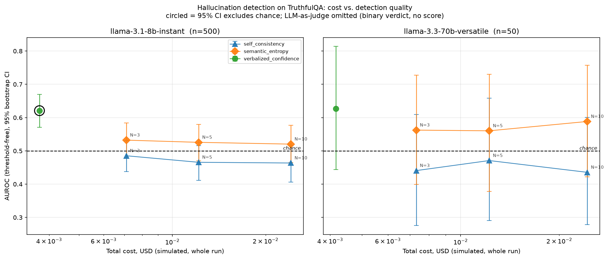
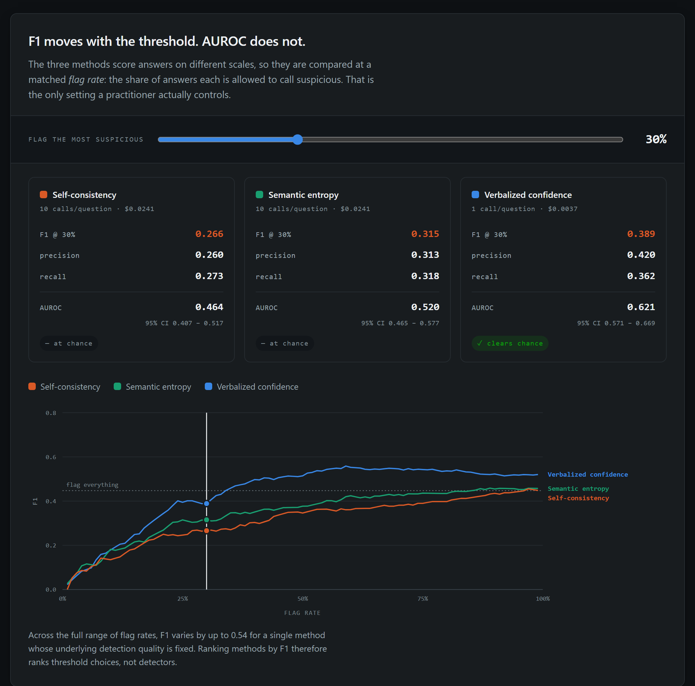
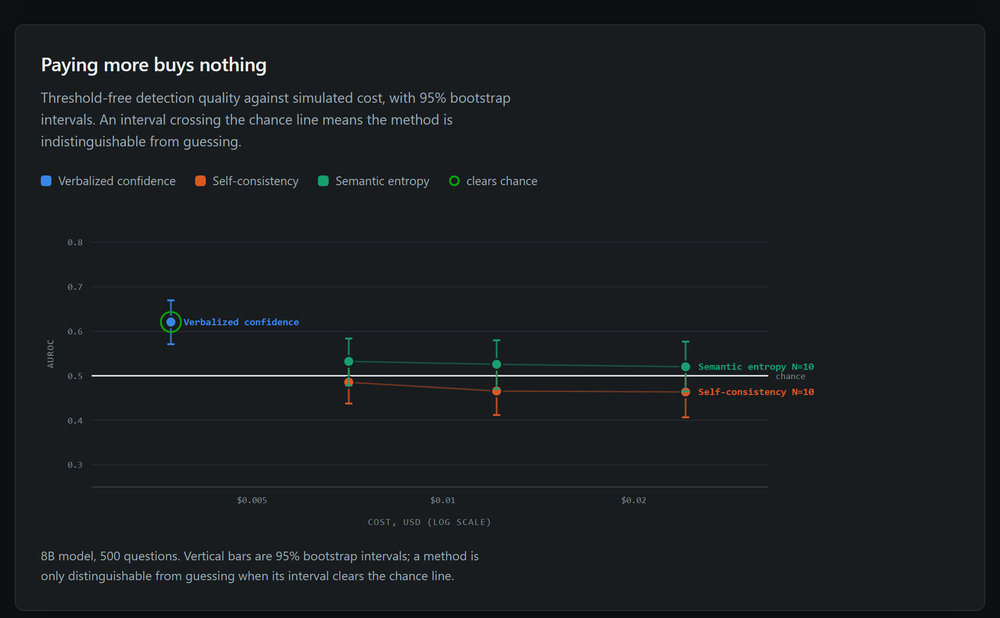

# Consistency Is Not Correctness

Cost-normalized comparison of four black-box hallucination-detection methods on
TruthfulQA, run end-to-end on free-tier APIs.

**Finding: of 14 scored configurations, one detects hallucination better than
chance — the cheapest.** Sampling-based methods (self-consistency, semantic
entropy) perform indistinguishably from random guessing at every sample count
while costing up to 6.5x more. Ranking the same data by F1, the metric this
literature usually reports, inverts the conclusion.

Full write-up: [`writeup.md`](writeup.md)

## Results

500 questions, `llama-3.1-8b-instant`, 5,000 detections. Base rate 28.0%, so a
detector that flags everything scores F1 = 0.438.

| Method | Calls/question | Cost (500 q) | AUROC [95% CI] | Best swept F1 |
|---|---|---|---|---|
| **Verbalized confidence** | **1** | **$0.0037** | **0.621 [0.571, 0.670]** | **0.548** |
| LLM-as-judge | 2 | $0.0052 | — (binary verdict) | 0.336 |
| Semantic entropy (N=3) | 3 | $0.0071 | 0.532 [0.478, 0.584] | 0.457 |
| Semantic entropy (N=10) | 10 | $0.0241 | 0.520 [0.465, 0.577] | 0.457 |
| Self-consistency (N=3) | 3 | $0.0071 | 0.485 [0.438, 0.530] | 0.450 |
| Self-consistency (N=10) | 10 | $0.0241 | 0.464 [0.407, 0.517] | 0.445 |

A further 500 detections cover `llama-3.3-70b-versatile` at n=50, capped by its
free-tier quota. No 70B configuration reaches significance at that sample size.



Each point is one configuration; bars are 95% bootstrap intervals. Only the
circled point's interval clears the chance line.

## Interactive explorer

`results/explorer.html` is a self-contained page (no build step, no network) for
inspecting the same data. Open it in any browser.

The threshold slider is the point of it: dragging it recomputes F1 for every
method while AUROC stays fixed, which is the clearest way to see that F1
measures the operating point rather than the detector.





## Reproducing

Requires a free [Groq](https://console.groq.com/keys) API key. No paid account
needed; the whole experiment runs inside the free tier.

```bash
pip install -r requirements.txt
cp .env.example .env          # then paste your GROQ_API_KEY into .env

cd src
python prepare_data.py        # downloads + samples TruthfulQA
python run_experiment.py --limit 2   # smoke test first
python run_experiment.py      # full run, ~1h (rate-limited)
python analyze.py             # summary table + plot
```

`run_experiment.py` is safe to interrupt and re-run: completed
`(question, method, model, N)` rows are skipped, which matters because the 70B
model allows only 1,000 requests/day.

## Layout

```
src/
  config.py            models, thresholds, pricing, rate limits
  prepare_data.py      TruthfulQA download + nested subsampling
  llm_clients.py       Groq wrapper, rate limiting, 429 retry
  cost_tracker.py      per-call cost/latency logging, resume support
  detectors/
    verbalized_confidence.py   1 call, self-reported 0-100 confidence
    llm_judge.py               1 generation + 1 verifier call
    sampling.py                shared sampling for the two methods below
    self_consistency.py        majority-answer agreement across N samples
    semantic_entropy.py        entropy over embedding clusters of N samples
  run_experiment.py    main loop
  analyze.py           F1 / AUROC / bootstrap CIs / Pareto plot
results/
  raw_runs.csv         5,500 rows: one logged detection each
  summary.csv          per-configuration metrics
  pareto_plot.png      cost vs AUROC with confidence intervals
  explorer.html        interactive threshold explorer (self-contained)
writeup.md             paper-style report
```

## Notes on method

Two implementation details are load-bearing rather than incidental:

- **Answers are elicited in short form.** Self-consistency compares samples by
  string match, and free-form paragraph answers never match — which pins
  agreement at exactly 1/N for every question and makes the detector fire on
  everything. TruthfulQA is a short-answer benchmark, so constraining length is
  also how it is meant to be evaluated.
- **Samples are drawn once at N=10 and the sweep scores prefixes.** Draws are
  i.i.d. at fixed temperature, so a length-*n* prefix is distributed identically
  to an independent *n*-sample draw, and each N is charged only for the calls it
  consumes. This cuts 41 calls per (question, model) to 13.

Raw continuous scores are logged alongside binary predictions so thresholds can
be swept in analysis without re-running against rate-limited APIs.

## Caveats

- **Not novel.** This reproduces a populated sub-area — see §2 of the write-up
  for the prior work it replicates. What it adds is a negative result with
  confidence intervals and the demonstration that F1 reverses the ranking.
- **Ground-truth labels are model-generated**, by a grader that is also one of
  the models under test. This is the weakest link in the design.
- **Costs are simulated.** Both models ran on free tiers; dollar figures are
  token counts priced at published pay-as-you-go rates. The constants in
  `config.py` are marked `UNVERIFIED` and should be checked against current
  pricing before being cited.
- **One benchmark, and it is adversarial.** TruthfulQA is built from
  misconceptions, plausibly a worst case for consistency-based methods. Whether
  the finding transfers to ordinary factual QA is untested.
- **The strongest cheap baseline is missing.** No free-tier API exposes token
  log-probs, so verbalized confidence stands in for log-prob uncertainty.

## License

MIT — see [`LICENSE`](LICENSE).
